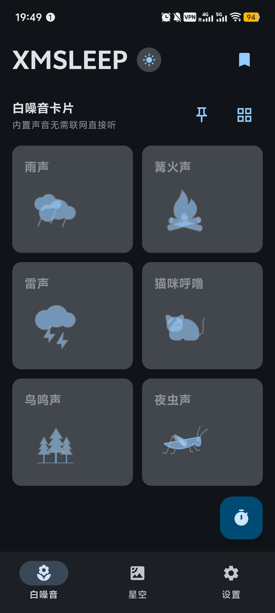
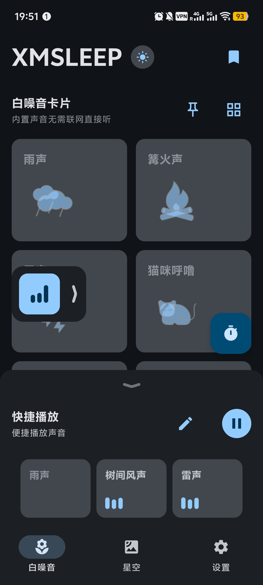
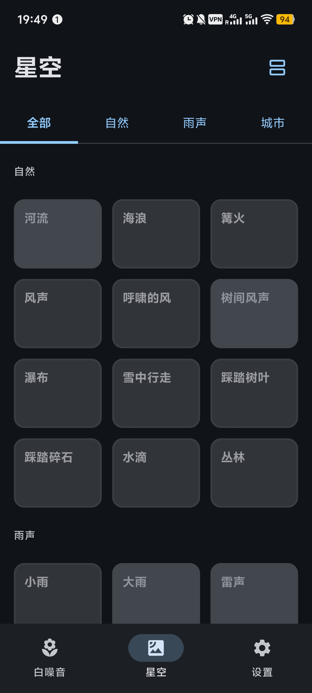
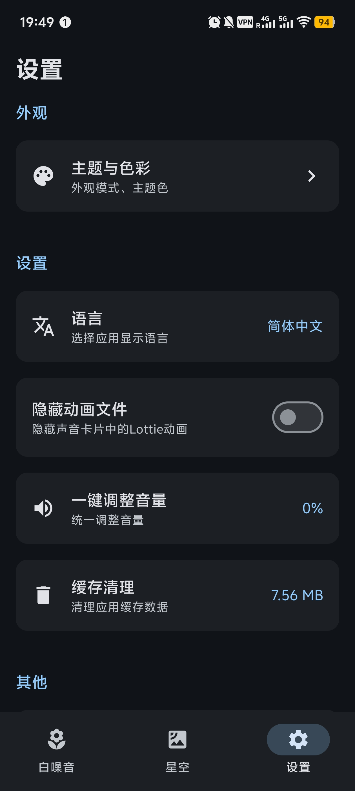
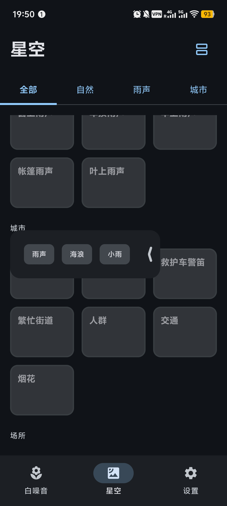
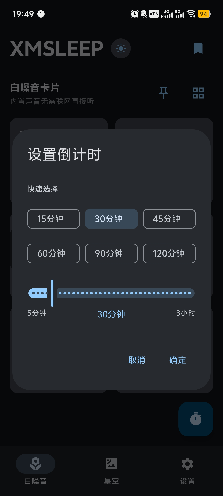

<h1 align="center"> 📱 XMSLEEP
 </h1>

<div align="center">

A white noise and natural sound player app to help you relax, focus, and sleep better.

[](LICENSE)
[](https://kotlinlang.org/)
[](https://www.android.com/)

[Download](#download) • [Features](#features) • [Usage](#usage) • [Changelog](#changelog)

**Language**: [中文](README.md) | English  

<a href="https://hellogithub.com/repository/Tosencen/XMSLEEP" target="_blank"></a>

</div>

## 📱 Screenshots

<div align="center">

<table>
  <tr>
    <td align="center">
      
    </td>
    <td align="center">
      
    </td>
    <td align="center">
      
    </td>
  </tr>
  <tr>
    <td align="center">
      
    </td>
    <td align="center">
      
    </td>
    <td align="center">
      
    </td>
  </tr>
</table>

</div>

---

## 📱 About

XMSLEEP is a professional white noise and natural sound playback app dedicated to providing you with high-quality audio experiences. The app includes a variety of carefully selected natural sounds, including rain, thunder, campfire, bird chirping, and more, to help you relax, improve focus, and enhance sleep quality.

Built with Material Design 3 guidelines, the app features a clean and beautiful interface with smooth and intuitive operations.

## ✨ Features

### 🎵 Audio Features
- **Multiple White Noise**: Provides rain, campfire, thunder, cat purring, birds, crickets, and more natural sounds
- **Online Audio**: Support for dynamically loading more audio resources from GitHub
- **Seamless Loop**: Audio supports seamless loop playback for an immersive experience
- **Volume Control**: Support for independent volume adjustment for each sound, or one-click adjustment for all sounds

### 🎨 Interface & Experience
- **Beautiful Animations**: Built-in sounds come with WebP animations to enhance visual experience
- **Material Design 3**: Adopts the latest Material Design 3 design guidelines
- **Theme Switching**: Supports light/dark mode switching, adapts to system theme
- **Custom Themes**: Multiple color themes available, supports dynamic colors

### ⚙️ Practical Features
- **Countdown Feature**: Set automatic stop playback time to help you control usage duration
- **Quick Play Area**: Support for adding frequently used sounds to the quick play area for quick access
- **Favorites**: Favorite your preferred white noise sounds
- **Global Floating Button**: Displays currently playing sounds, supports quick pause and expand to view
- **Auto Update**: Supports automatic update checking via GitHub Releases

## 🛠️ Tech Stack

- **Kotlin** - Main development language
- **Jetpack Compose** - Modern UI framework
- **Material Design 3** - UI design system
- **ExoPlayer/Media3** - Audio playback engine with seamless loop support
- **OkHttp** - Network requests and file downloads
- **Gson** - JSON parsing
- **Kotlinx Serialization** - JSON serialization
- **Coil** - Image loading
- **WebP** - Animation support (sound card animations)
- **MaterialKolor** - Dynamic theme color generation
- **Accompanist** - Pull-to-refresh support

## 📦 Current Version

- **Version**: 2.0.8
- **Version Code**: 28
- **Min SDK**: Android 8.0 (API 26)
- **Target SDK**: Android 15 (API 35)

## 🚀 Download

Latest version available on [GitHub Releases](https://github.com/Tosencen/XMSLEEP/releases).

## 📋 Build Requirements

- **Android Studio**: Hedgehog | 2023.1.1 or higher
- **JDK**: 17 or higher
- **Android SDK**: API 33 or higher
- **Gradle**: 8.0 or higher

## 🔨 Build Steps

1. **Clone Repository**
   ```bash
   git clone https://github.com/Tosencen/XMSLEEP.git
   cd XMSLEEP
   ```

2. **Configure Gradle**
   - Copy `gradle.properties.example` to `gradle.properties`
   - (Optional) Configure GitHub Token to increase API limits

3. **Open Project**
   - Open the project with Android Studio
   - Sync Gradle dependencies

4. **Run Project**
   - Connect device or start emulator
   - Click Run button

## 📖 Usage

### Basic Operations
1. **Play Sound**: Tap sound card to start playback, tap again to stop
2. **Adjust Volume**: Tap volume icon at bottom-right of card to adjust volume for each sound individually
3. **Set Countdown**: Tap countdown button at bottom-right to set auto-stop time

### Interface Operations
4. **Switch Theme**: Tap theme switch button at top-left to switch between light and dark modes
5. **Custom Settings**: Adjust theme colors, hide animations, etc. in settings page
6. **Quick Play Area**: Tap sound card title, select "Pin" to add sound to quick play area
7. **Favorites**: Tap sound card title, select "Favorite" to add sound to favorites list

### Advanced Features
8. **Global Floating Button**: When sounds are playing, a floating button appears, tap to expand and view currently playing sounds
9. **Long Press Drag to Stop**: Long press floating button to drag, drag to bottom red area to stop all playback

## 📝 Changelog

### v2.0.8 (2025-11-26)
- 🎨 **Theme Optimization**: Dark mode card colors fully follow app theme
- 🍃 **Toast Improvement**: Toast background fully adapts to light/dark theme
- 🔒 **Pin Validation**: Prevent pinning uncached cards, show tips only
- 📱 **Remote Audio**: Remove broken campfire card with 404 error

### v2.0.7 (2025-11-17)
- 🎛 **Preset Optimization**: Improved preset module visibility logic for clearer behavior when clearing or switching presets
- 🧩 **Preset Tabs**: Preset 1/2/3 tabs now support horizontal scrolling, long labels are no longer truncated
- ▶️ **Floating Play**: Global floating button now auto-collapses when the bottom preset panel is expanded
- 🎬 **Card Animation**: Playing items in the expanded floating list now slide out to the left with a unified removal animation

### v2.0.6 (2025-11-14)
- 🎨 **UI**: Comprehensive floating button optimization (animation, shadow, layout)
- 🐛 **Fix**: Fixed remote audio control and click-through issues
- 🆕 **Feature**: Added global exception handling and crash screen
- 🌍 **i18n**: Completed all English translations (100+ strings)
- 🎨 **Theme**: Adjusted default primary color and slogan colors

### v2.0.5
- 🎵 **Feature**: New floating play button with sticky interaction
- 🔧 **Optimization**: Code refactoring and modularization

### v2.0.4
- 🔒 **Security**: Network security configuration optimization
- 📦 **Optimization**: Audio file and APK size optimization

### v2.0.3
- 🎨 **Improvement**: WebP animation cover display optimization
- 🐛 **Fix**: Countdown playback stop fix

View full changelog: [GitHub Releases](https://github.com/Tosencen/XMSLEEP/releases)

## 📚 Documentation

More technical documentation available in [docs](./docs/) directory:

- [Audio Architecture Design](./docs/AUDIO_ARCHITECTURE.md) - Audio resource management architecture documentation
- [Audio Resource Management](./docs/AUDIO_RESOURCES.md) - Audio resource management guide
- [Sound Modules Resource List](./docs/SOUND_MODULES_RESOURCES.md) - Sound modules resource list

## ⚠️ Sound Source Attribution

Sound sources in this app are as follows:

- **Built-in Sounds**: From open-source audio resource libraries
- **Online Sounds**: From [moodist](https://github.com/remvze/moodist) project, following MIT open-source license
- **Third-party Resources**: Some sounds from third-party providers, following respective licenses
  - Sounds following **Pixabay Content License**: [Pixabay Content License](https://pixabay.com/service/license-summary/)
  - Sounds following **CC0**: [Creative Commons Zero License](https://creativecommons.org/publicdomain/zero/1.0/)

## 📄 License

This project is licensed under the [MIT License](LICENSE).

## 🤝 Contributing

Issues and Pull Requests are welcome!

### Contribution Guide
1. Fork this repository
2. Create feature branch (`git checkout -b feature/AmazingFeature`)
3. Commit changes (`git commit -m 'Add some AmazingFeature'`)
4. Push to branch (`git push origin feature/AmazingFeature`)
5. Open Pull Request

## 👤 Author

**Tosencen**

- GitHub: [@Tosencen](https://github.com/Tosencen)

## 🙏 Acknowledgments

- [moodist](https://github.com/remvze/moodist) - Online audio resource source
- [Material Design 3](https://m3.material.io/) - UI design guidelines
- [MaterialKolor](https://github.com/material-foundation/material-color-utilities) - Dynamic color scheme

---

<div align="center">

**⭐ If this project helps you, please give it a Star!**

© 2025 XMSLEEP. All rights reserved.

</div>

