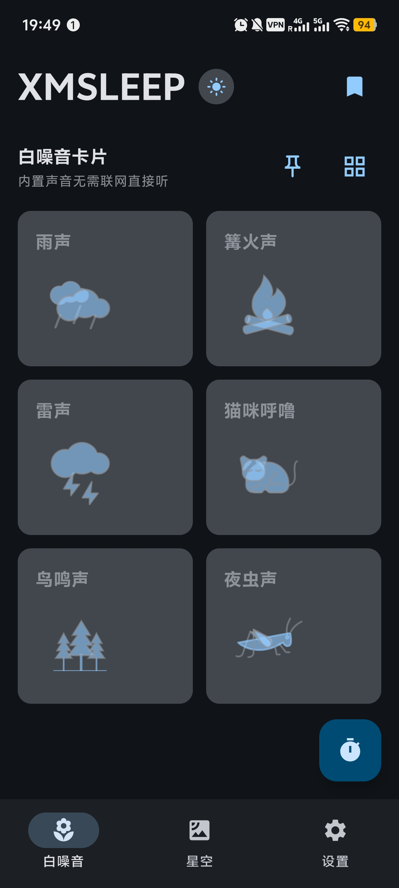
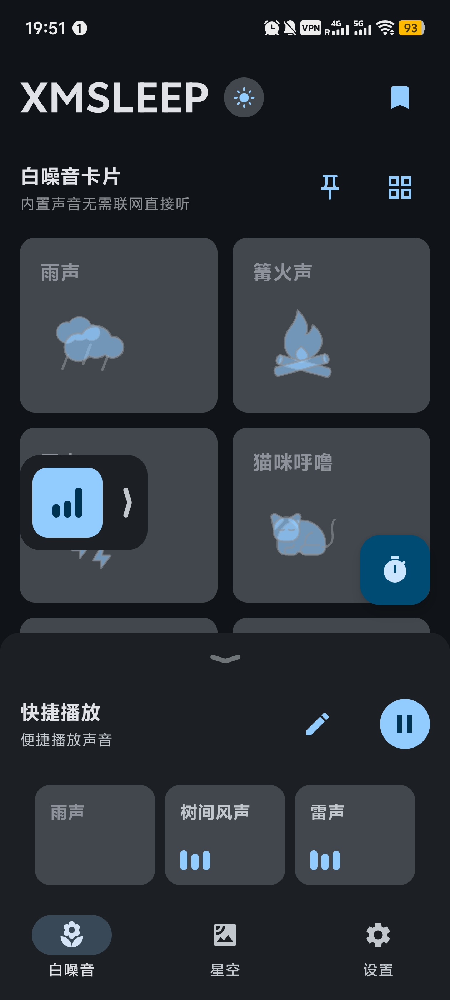
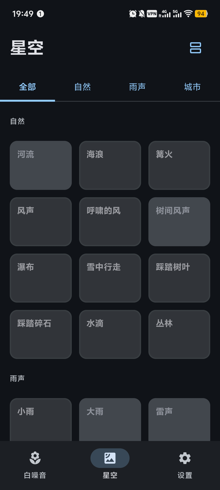
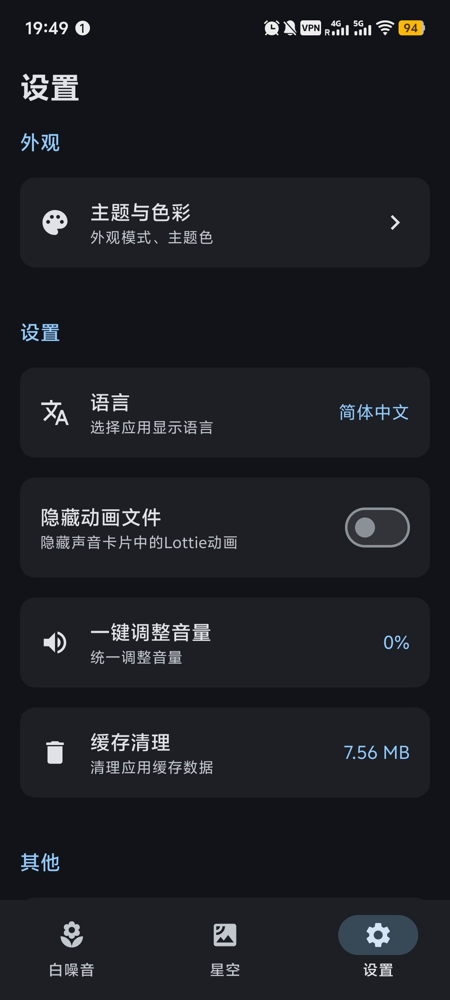
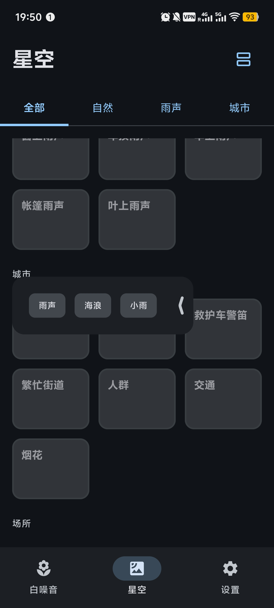
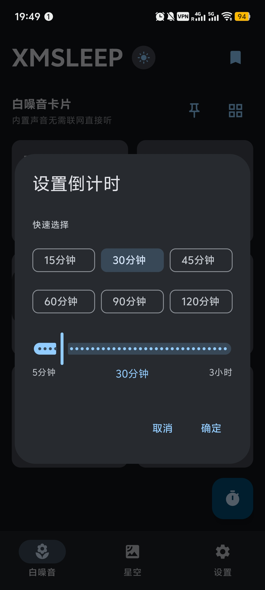

<h1 align="center"> 📱 XMSLEEP
 </h1>

<div align="center">

A white noise and natural sound player app to help you relax, focus, and sleep better.

[](LICENSE)
[](https://kotlinlang.org/)
[](https://www.android.com/)
[](https://tosencen.github.io/XMSLEEP/player.html)

[Download](#download) • [Features](#features) • [Usage](#usage) • [Web Version](#-web-version)

**Language**: [中文](README.md) | [繁體中文](README_ZH_TW.md) | English | [한국어](README_KO.md) | [Русский](README_RU.md) | [日本語](README_JA.md)

<a href="https://hellogithub.com/repository/Tosencen/XMSLEEP" target="_blank"></a>

</div>

## 📱 Screenshots

<div align="center">

<table>
  <tr>
    <td align="center">
      
    </td>
    <td align="center">
      
    </td>
    <td align="center">
      
    </td>
  </tr>
  <tr>
    <td align="center">
      
    </td>
    <td align="center">
      
    </td>
    <td align="center">
      
    </td>
  </tr>
</table>

</div>

---

## 🌐 Web Version

No installation needed — try the full experience right in your browser: **113 ambient sounds · free mixing · seamless looping · 6 languages · countdown timer**, with the same sound library as the mobile app.

👉 **Play online**: [tosencen.github.io/XMSLEEP/player.html](https://tosencen.github.io/XMSLEEP/player.html)

> In the app: Settings → Others → Web Version for one-tap access and link sharing.

---

## 📱 About

XMSLEEP is a professional white noise and natural sound playback app dedicated to providing you with high-quality audio experiences. The app includes a variety of carefully selected natural sounds, including rain, thunder, campfire, bird chirping, and more, to help you relax, improve focus, and enhance sleep quality.

Built with Material Design 3 guidelines, the app features a clean and beautiful interface with smooth and intuitive operations.

## ✨ Features

### 🎵 Audio Features
- **Multiple White Noise**: Provides rain, campfire, thunder, cat purring, birds, crickets, and more natural sounds
- **Online Audio**: Support for dynamically loading more audio resources from GitHub
- **Local Audio**: Support for playing audio files from your phone
- **Seamless Loop**: Audio supports seamless loop playback for an immersive experience
- **Volume Control**: Support for independent volume adjustment for each sound, or one-click adjustment for all sounds
- **Volume Persistence**: Volume settings are automatically saved and restored on app restart
- **Bluetooth Headset Support**: Automatically pauses playback when Bluetooth headset disconnects
- **Bilibili Live Radio**: Search and play Bilibili live streaming rooms, pin favorite rooms for quick access

### 🎨 Interface & Experience
- **Beautiful Animations**: Built-in sounds come with WebP animations to enhance visual experience
- **Material Design 3**: Adopts the latest Material Design 3 design guidelines
- **Theme Switching**: Supports light/dark mode switching, adapts to system theme
- **Custom Themes**: Multiple color themes available, supports dynamic colors

### ⚙️ Practical Features
- **Countdown Feature**: Set automatic stop playback time to help you control usage duration
- **Preset Area**: Support for adding frequently used sounds to preset area, supports up to 3 preset configurations for quick switching
- **Favorites**: Favorite your preferred white noise sounds
- **Recent Play**: Shows recent play dialog on app restart for quick resume
- **Global Floating Button**: Displays currently playing sounds, supports quick pause and expand to view
- **Smart Interaction**: Preset sheet and floating button are mutually exclusive; both auto-hide when scrolling
- **Auto Update**: Supports silent update checking via GitHub Releases, update icon appears when new version available

### 🌐 Web Version
- **Online Player**: Runs instantly in the browser — 113 ambient sounds with free mixing, seamless looping, and independent volume control
- **Multi-language**: Chinese/English/Japanese/Korean/Russian/Traditional Chinese
- **Countdown Timer**: Custom countdown with auto-stop and live time display
- **Now Playing Panel**: View/stop/adjust volume of active sounds at a glance
- **Performance**: First-screen prefetch + LRU caching for instant replays

## 🛠️ Tech Stack

- **Kotlin** - Main development language
- **Jetpack Compose** - Modern UI framework
- **Material Design 3** - UI design system
- **ExoPlayer/Media3** - Audio playback engine with seamless loop support
- **OkHttp** - Network requests and file downloads
- **Gson** - JSON parsing
- **Kotlinx Serialization** - JSON serialization
- **Coil** - Image loading
- **WebP** - Animation support (sound card animations)
- **MaterialKolor** - Dynamic theme color generation
- **Accompanist** - Pull-to-refresh support
- **Hilt** - Dependency injection framework
- **Lottie** - High-quality animation rendering
- **Web Audio API** - Seamless looping in the web player (sample-accurate)

## 📦 Current Version

- **Version**: 2.3.3
- **Version Code**: 48
- **Min SDK**: Android 8.0 (API 26)
- **Target SDK**: Android 15 (API 35)

## 🆕 Latest Updates

### v2.3.3

#### 🎨 New Features
- **Random Bing background for Daily Quote**: The daily-quote dialog now uses a random Bing daily wallpaper (memory-only cache, no disk usage); text is bottom-aligned with a darker gradient for readability; the share/save poster also uses the daily image
- **Sensitive-word filter**: Daily quotes auto-block self-harm/severely negative words (e.g. suicide, depression); on an API hit it retries, and local quotes are skipped

#### ✨ Improvements
- **Daily Quote dialog**: Fixed to 2/3 of screen height with scrollable content; the refresh badge moved to the top-right with rounded corners

### v2.3.2

#### 🎨 New Features
- **QWeather source (BYOK)**: Weather now supports a user-provided QWeather key (enter Host + Key in Settings), falling back to Open-Meteo when unset; city-level location + multi-language

#### ✨ Improvements
- **Weather card**: City and date merged on one line (e.g. "Shanghai 8月25日 Tuesday") and placed above the healing quote; removed the source badge
- **Coordinate offset**: WGS84 → GCJ02 conversion for better domestic location accuracy

### v2.3.1
#### 🎨 New Features
- **Web Version Player**: New GitHub Pages online player — 113 ambient sounds, free mixing, seamless looping, 6-language UI, synced with the app's sound library, no installation required
- **Web Version Entry in App**: New "Web Version" entry at the top of the "Others" section in Settings — one-tap browser launch plus a copy-link button
- **Black & White Theme**: New monochrome theme for a minimalist look
- **Tomato Timer Background Timing**: Countdown keeps running after leaving the page; ruler shows the current phase duration
- **Tomato Settings Sheet Redesign**: Card-style sheet with ringtone preview and adjustable break length
- **Notification Media Controls**: Control meditation playback from the notification shade/lock screen
- **Plurals Localization**: Proper plural forms for counts in English, Russian and other languages

#### ✨ Improvements
- **Tightened Permissions**: Streamlined permission declarations to reduce privacy exposure
- **Firebase Analytics & Crash Reporting**: Anonymous usage stats and crash collection — no personally identifiable information
- **Dependency Upgrades**: okhttp 5.3.2, gson 2.11.0, androidx.media 1.8.0, core-splashscreen 1.2.0
- **Resource & Signing Cleanup**

#### 🐛 Bug Fixes
- Custom countdown display issue
- Breathing service registration & notification localization

### v2.3.0
#### 🎨 New Features
- **Tomato Timer End Ringtone**: 4 built-in royalty-free ringtones (Chime/Ding-Dong/Marimba/Wind Chime), plays automatically when focus ends
- **Tomato Timer End Vibration**: Automatic vibration reminder when focus ends, with a settings toggle
- **Tomato Settings Sheet**: Gear icon in the top-right of the tomato page — configure end ringtone, completion animation, and vibration, fully expanded sheet
- **Ringtone/Vibration ×3**: End ringtone and vibration each repeat 3 times then stop automatically
- **Manual Break Start**: Focus no longer auto-starts the break — a "Start Break" button appears for the user to trigger manually
- **Meditation Repeat Count**: The meditation detail countdown is replaced by a repeat-count control — loop 1/2/3 times then auto-stop, mutually exclusive with infinite loop
- **Tomato Entry in Weather Mode**: Added a tomato timer shortcut in the top-right of weather mode

#### ✨ Improvements
- **Tomato Settings Multi-language**: Supports Chinese/English/Japanese/Korean/Russian/Traditional Chinese
- **Vibration Implementation**: Now uses the system Vibrator directly with the VIBRATE permission added for reliability
- **Version Bump**: 2.2.9 → 2.3.0

### v2.2.6
#### 🎨 New Features
- **Bilibili Live Radio**: Added Bilibili live streaming radio feature, search for study rooms, white noise, and more categories
- **Pin Rooms**: Favorite frequently used live rooms for quick switching; non-live rooms are automatically grayed out

#### ✨ Improvements
- **Edit Mode Optimization**: Auto-close pin edit mode when dismissing the bottom sheet to prevent accidental operations
- **Preset Dialog Improvement**: Reset edit state when closing the preset name edit dialog

### v2.2.3
#### 🎨 New Features
- **Daily Quote Widget**: Added home screen widget displaying time, daily quote, and refresh button

### v2.2.1
#### 🎨 New Features
- **Breathing Exercise**: Added guided breathing feature to help users relax

#### ✨ Improvements
- **Screen On**: Optimized screen-on settings
- **Weather Audio Mapping**: Improved weather and audio mapping

### v2.2.0 (2025-02-03)

#### 🎨 New Features
- **WebP Animated Backgrounds**: Added dynamic background feature with multiple beautiful WebP animated background options
- **Glassmorphism Effect**: Implemented true glassmorphism blur effect for bottom navigation bar, enhancing visual experience

#### ✨ Improvements
- **UI Layout Optimization**:
  - Adjusted bottom navigation bar position (from 46dp to 32dp) for better screen alignment
  - Optimized spacing between bottom navigation bar and floating button to avoid overlap
  - Improved content scrolling experience
  
- **Toast Display Optimization**:
  - Fixed Toast center display issue
  - Cleaned up unused code comments

- **Dynamic Color Feature**:
  - Fixed and optimized dynamic theme color extraction functionality
  - Improved color adaptation effects

- **Settings Page Optimization**:
  - Optimized countdown display for light bulb feature

#### 🔧 Technical Improvements
- Code structure optimization
- Performance enhancements

### v2.1.5 (2025-01-16)
- 🎵 **Audio Optimization**: All audio files converted to OGG format for better compatibility
- 📦 **File Compression**: Recompressed large audio files, reducing app size by ~40%
- 🔧 **Path Fix**: Fixed audio file path issues, resolved download failures (HTTP 404 errors)
- 📝 **Manifest Update**: Updated audio manifest version to 1.0.3, forcing cache refresh to ensure all audio is available
- 🐛 **Bug Fixes**: Fixed AudioResourceManager compilation error
- 🧹 **Code Cleanup**: Cleaned up debug logs, improved code quality

## 🚀 Download

Latest version available on [GitHub Releases](https://github.com/Tosencen/XMSLEEP/releases).

## 📋 Build Requirements

- **Android Studio**: Ladybug | 2024.2.1 or higher
- **JDK**: 17 or higher
- **Android SDK**: API 33 or higher
- **Gradle**: 8.0 or higher

## 🔨 Build Steps

1. **Clone Repository**
   ```bash
   git clone https://github.com/Tosencen/XMSLEEP.git
   cd XMSLEEP
   ```

2. **Configure Gradle**
   - Copy `gradle.properties.example` to `gradle.properties`
   - (Optional) Configure GitHub Token to increase API limits

3. **Open Project**
   - Open the project with Android Studio
   - Sync Gradle dependencies

4. **Run Project**
   - Connect device or start emulator
   - Click Run button

## 📖 Usage

### Basic Operations
1. **Play Sound**: Tap sound card to start playback, tap again to stop
2. **Adjust Volume**: Tap volume icon at bottom-right of card to adjust volume for each sound individually
3. **Set Countdown**: Tap countdown button at bottom-right to set auto-stop time

### Interface Operations
4. **Switch Theme**: Tap theme switch button at top-left to switch between light and dark modes
5. **Custom Settings**: Adjust theme colors, hide animations, etc. in settings page
6. **Preset Management**: Tap sound card title, select "Pin" to add sound to preset area; supports up to 3 preset configurations, swipe left/right to switch
7. **Favorites**: Tap sound card title, select "Favorite" to add sound to favorites list
8. **Bilibili Radio**: Tap the search button on the radio page to search Bilibili live rooms by category, tap the pin icon to favorite frequently used rooms

### Advanced Features
9. **Global Floating Button**: When sounds are playing, a floating button appears, tap to expand and view currently playing sounds
10. **Long Press Drag to Stop**: Long press floating button to drag, drag to bottom red area to stop all playback
11. **Batch Add to Preset**: When floating button is expanded, batch add currently playing sounds to the current preset

## ⚠️ Sound Source Attribution

Sound sources in this app are as follows:

- **Built-in Sounds**: From open-source audio resource libraries
- **Online Sounds**: From [moodist](https://github.com/remvze/moodist) project, following MIT open-source license
- **Third-party Resources**: Some sounds from third-party providers, following respective licenses
  - Sounds following **Pixabay Content License**: [Pixabay Content License](https://pixabay.com/service/license-summary/)
  - Sounds following **CC0**: [Creative Commons Zero License](https://creativecommons.org/publicdomain/zero/1.0/)

## 🔒 Privacy

This app values your privacy. To improve the product, it collects **anonymous** usage statistics (e.g., active user counts, crash reports) and does **not** collect any personally identifiable information.

## 📄 License

This project is licensed under the [MIT License](LICENSE).

## 🤝 Contributing

Issues and Pull Requests are welcome!

### Contribution Guide
1. Fork this repository
2. Create feature branch (`git checkout -b feature/AmazingFeature`)
3. Commit changes (`git commit -m 'Add some AmazingFeature'`)
4. Push to branch (`git push origin feature/AmazingFeature`)
5. Open Pull Request

## 👤 Author

**Tosencen**

- GitHub: [@Tosencen](https://github.com/Tosencen)

## 🙏 Acknowledgments

- [moodist](https://github.com/remvze/moodist) - Online audio resource source
- [Material Design 3](https://m3.material.io/) - UI design guidelines
- [MaterialKolor](https://github.com/material-foundation/material-color-utilities) - Dynamic color scheme

---

<div align="center">

**⭐ If this project helps you, please give it a Star!**

© 2026 XMSLEEP. All rights reserved.

</div>
