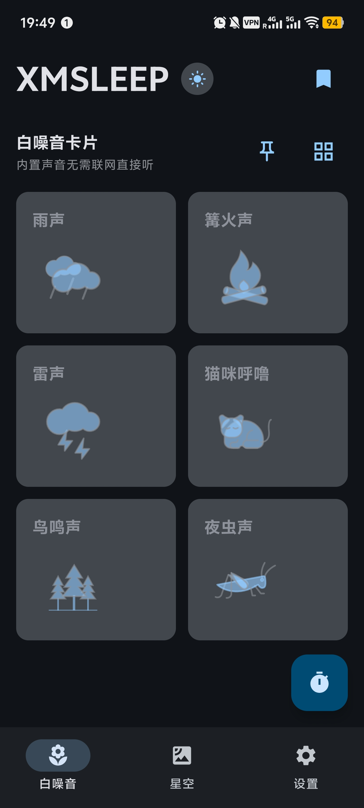
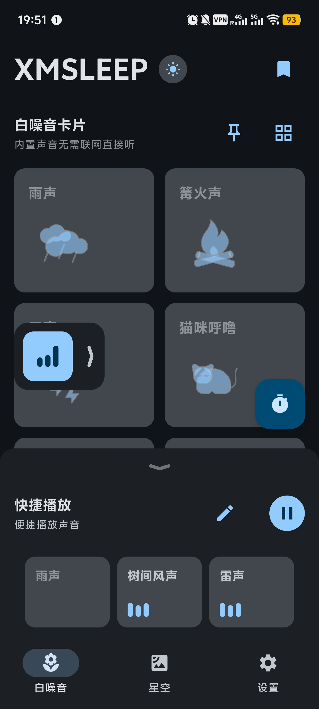
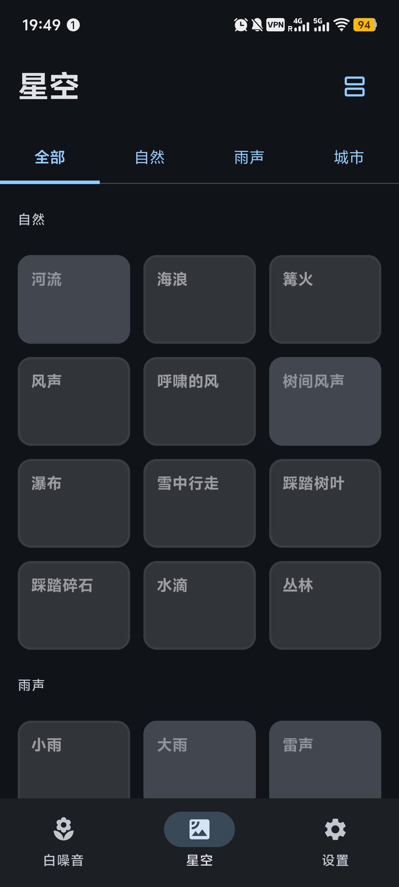
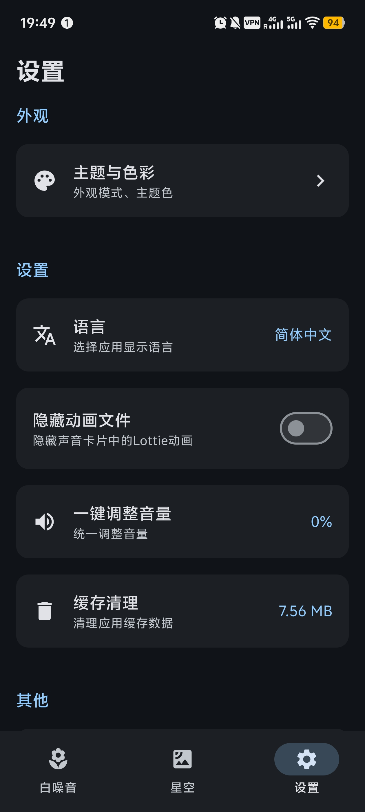
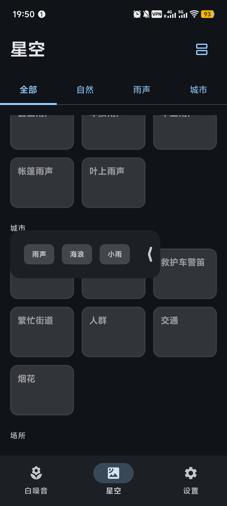
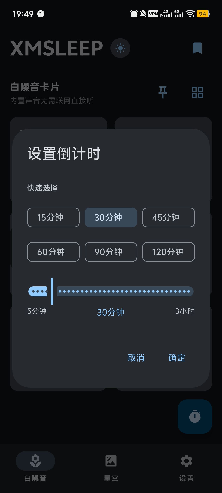

<h1 align="center"> 📱 XMSLEEP
 </h1>

<div align="center">

Приложение для воспроизведения белого шума и природных звуков, помогающее расслабиться, сосредоточиться и лучше спать.

[](LICENSE)
[](https://kotlinlang.org/)
[](https://www.android.com/)

[Скачать](#скачать) • [Возможности](#возможности) • [Инструкция](#инструкция)

**Language**: [中文](README.md) | [繁體中文](README_ZH_TW.md) | [English](README_EN.md) | [한국어](README_KO.md) | Русский | [日本語](README_JA.md)

<a href="https://hellogithub.com/repository/Tosencen/XMSLEEP" target="_blank"></a>
</div>

## 📱 Скриншоты

<div align="center">

<table>
  <tr>
    <td align="center">
      <a href="screenshots/1.jpg"></a>
    </td>
    <td align="center">
      <a href="screenshots/2.jpg"></a>
    </td>
    <td align="center">
      <a href="screenshots/3.jpg"></a>
    </td>
  </tr>
  <tr>
    <td align="center">
      <a href="screenshots/4.jpg"></a>
    </td>
    <td align="center">
      <a href="screenshots/5.jpg"></a>
    </td>
    <td align="center">
      <a href="screenshots/6.jpg"></a>
    </td>
  </tr>
</table>

</div>

---

## 📱 О приложении

XMSLEEP — это профессиональное приложение для воспроизведения белого шума и природных звуков, созданное для улучшения вашего сна и концентрации. Приложение включает множество тщательно подобранных природных звуков: дождь, гром, костёр, пение птиц и многое другое.

## ✨ Возможности

### 🎵 Аудио функции
- **Множество звуков**: дождь, костёр, гром, мурлыканье кошки, птицы, сверчки и другие природные звуки
- **Онлайн аудио**: динамическая загрузка аудиоресурсов с GitHub
- **Локальное аудио**: воспроизведение аудиофайлов с вашего устройства
- **Бесшовный цикл**: непрерывное зацикленное воспроизведение
- **Регулировка громкости**: индивидуальная настройка громкости для каждого звука
- **Сохранение настроек**: громкость автоматически сохраняется и восстанавливается
- **Bluetooth гарнитура**: автоматическая пауза при отключении гарнитуры
- **Bilibili радио**: поиск и воспроизведение прямых эфиров Bilibili, возможность закреплять избранные комнаты

### 🎨 Интерфейс
- **Анимации**: встроенные звуки сопровождаются WebP анимацией
- **Material Design 3**: современный дизайн
- **Переключение тем**: светлая/тёмная тема, адаптация к системной теме
- **Пользовательские темы**: выбор цветовых тем, поддержка динамических цветов

### ⚙️ Полезные функции
- **Таймер**: установка времени автоматической остановки
- **Пресеты**: 3 пресета для быстрого переключения между наборами звуков
- **Избранное**: сохранение любимых звуков
- **Недавние**: быстрый доступ к недавно воспроизводившимся звукам
- **Плавающая кнопка**: отображение текущих звуков, быстрая пауза
- **Автообновление**: проверка обновлений через GitHub Releases

## 🛠️ Технологии

- **Kotlin** - основной язык
- **Jetpack Compose** - UI фреймворк
- **Material Design 3** - дизайн-система
- **ExoPlayer/Media3** - аудиодвижок
- **OkHttp** - сетевые запросы
- **Gson** - JSON парсинг
- **Kotlinx Serialization** - JSON сериализация
- **Coil** - загрузка изображений
- **WebP** - анимации
- **MaterialKolor** - генерация цветов
- **Accompanist** - Pull-to-refresh
- **Hilt** - фреймворк внедрения зависимостей
- **Lottie** - высококачественный рендеринг анимации

## 📦 Текущая версия

- **Версия**: 2.2.6
- **Version Code**: 41
- **Мин. SDK**: Android 8.0 (API 26)
- **Целевой SDK**: Android 15 (API 35)

### 🆕 Последнее обновление (v2.2.6)

#### 🎨 Новые функции
- **Bilibili радио**: добавлена функция прямых эфиров Bilibili, поиск по категориям (комнаты для занятий, белый шум и др.)
- **Закрепление комнат**: закрепляйте часто используемые комнаты для быстрого переключения, незанятые комнаты автоматически отображаются серым цветом

#### ✨ Улучшения
- **Оптимизация режима редактирования**: автоматическое отключение режима редактирования при закрытии нижнего листа
- **Улучшение диалога пресетов**: сброс состояния редактирования при закрытии диалога редактирования имени пресета

### Предыдущие версии

#### v2.2.3
- **Виджет цитат**: виджет на главный экран с отображением времени, ежедневной цитаты и кнопки обновления

#### v2.2.1
- **Дыхательное упражнение**: добавлена направленная дыхательная практика
- **Экран всегда включён**: оптимизация настроек экрана
- **Погодное сопоставление**: улучшено сопоставление погоды и звуков

## 🚀 Скачать

Последняя версия доступна на [GitHub Releases](https://github.com/Tosencen/XMSLEEP/releases).

## 📋 Требования к сборке

- **Android Studio**: Ladybug | 2024.2.1 или новее
- **JDK**: 17 или новее
- **Android SDK**: API 33 или новее
- **Gradle**: 8.0 или новее

## 🔨 Сборка

1. **Клонировать репозиторий**
   ```bash
   git clone https://github.com/Tosencen/XMSLEEP.git
   cd XMSLEEP
   ```

2. **Настроить Gradle**
   - Скопировать `gradle.properties.example` в `gradle.properties`
   - (Опционально) Настроить GitHub Token

3. **Открыть проект**
   - Открыть проект в Android Studio
   - Синхронизировать Gradle

4. **Запустить**
   - Подключить устройство или запустить эмулятор
   - Нажать кнопку запуска

## 📖 Инструкция

### Основы
1. **Воспроизведение**: нажмите на карточку звука для запуска
2. **Громкость**: нажмите на иконку громкости для регулировки
3. **Таймер**: установите время автоматической остановки

### Интерфейс
4. **Тема**: кнопка переключения темы в левом верхнем углу
5. **Настройки**: цвета темы, анимации и другие параметры
6. **Пресеты**: добавление звуков в пресет через заголовок карточки
7. **Переключение пресетов**: в нижней области пресетов
8. **Избранное**: через заголовок карточки звука
9. **Bilibili радио**: нажмите кнопку поиска на странице радио для поиска комнат Bilibili по категориям, нажмите на иконку булавки, чтобы закрепить часто используемые комнаты

### Продвинутые функции
10. **Плавающая кнопка**: отображается при воспроизведении звуков
11. **Массовое добавление**: в развёрнутом состоянии плавающей кнопки
12. **Автоскрытие**: при прокрутке или переключении вкладок

## ⚠️ Источники звуков

- **Встроенные звуки**: из библиотек с открытым исходным кодом
- **Онлайн звуки**: из проекта [moodist](https://github.com/remvze/moodist) (MIT)
- **Сторонние ресурсы**: в соответствии с лицензиями
  - **Pixabay Content License**: [Pixabay](https://pixabay.com/service/license-summary/)
  - **CC0**: [Creative Commons Zero](https://creativecommons.org/publicdomain/zero/1.0/)

## 📄 Лицензия

Этот проект распространяется под лицензией [MIT License](LICENSE).

## 🤝 Вклад

Приветствуются Issue и Pull Request!

### Руководство
1. Сделайте форк репозитория
2. Создайте ветку (`git checkout -b feature/AmazingFeature`)
3. Зафиксируйте изменения (`git commit -m 'Add some AmazingFeature'`)
4. Отправьте в ветку (`git push origin feature/AmazingFeature`)
5. Откройте Pull Request

## 👤 Автор

**Tosencen**

- GitHub: [@Tosencen](https://github.com/Tosencen)

## 🙏 Благодарности

- [moodist](https://github.com/remvze/moodist) - онлайн аудио ресурсы
- [Material Design 3](https://m3.material.io/) - дизайн-система
- [MaterialKolor](https://github.com/material-foundation/material-color-utilities) - динамические цвета

---

<div align="center">

**⭐ Если этот проект помог вам, поставьте Star!**

© 2026 XMSLEEP. All rights reserved.

</div>
